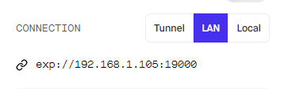
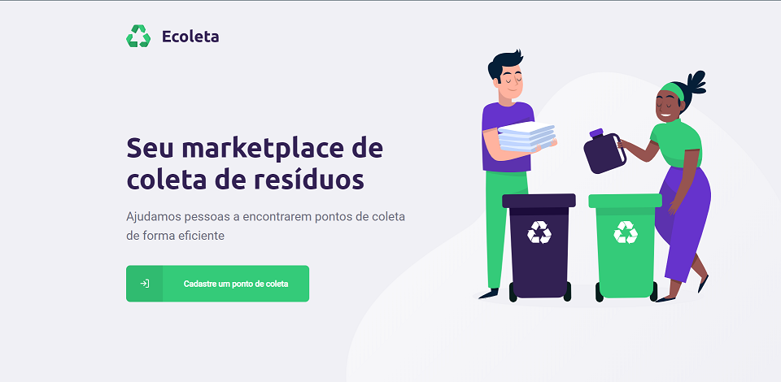
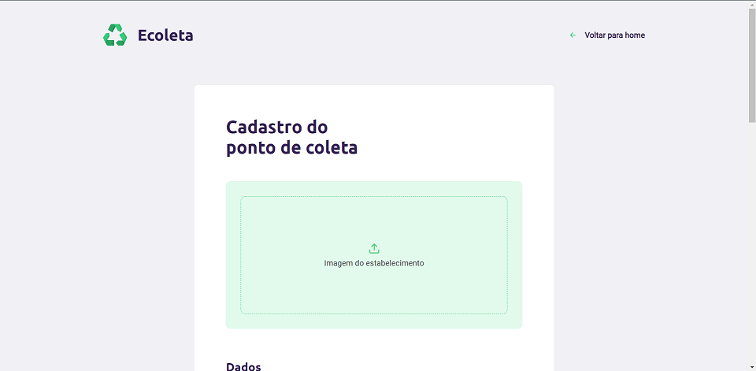
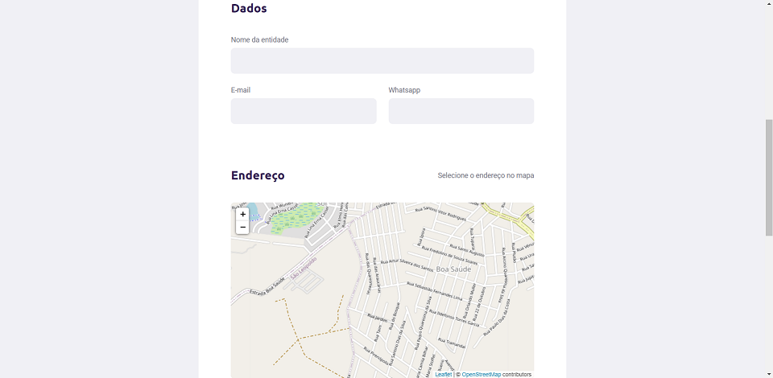
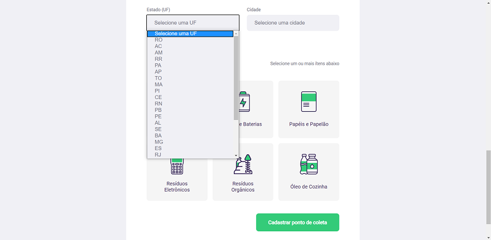
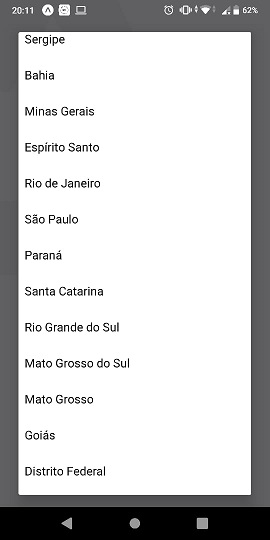
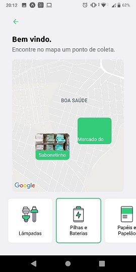
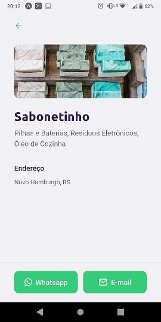

# Ecoleta

Durante a primeira Next Level Week foi desenvolvida um aplicação web para cadastro de pontos de coletas de resíduos utilizando a API do IBGE, mobile para a busca dos mesmos e uma API para gerenciar toda a aplicação:

A aplicação é feita utilizando JavaScript com o recurso TypeScrypt.

## Como Executar

Clone ou faça o download do repositório.

Para executar a API Node rode os seguintes comandos no diretório Server:
```sh
npm i
npx knex --knexfile knexfile.ts migrate:latest
npm run dev
```

Para executar o componente React rode os seguintes comandos no diretório Web:
```sh
npm i
npm start
```

Para executar o componente React Native rode os seguintes comandos no diretório Mobile:
```sh
npm i
```
Digite 'y' quando soliciatar a instalação do Expo CLI
```sh
npm start
```

Obs: Caso a aplicação seja executada em linux pode ocorrer o erro ENOSPC, então execute o seguinte comando:
```sh
echo fs.inotify.max_user_watches=524288 | sudo tee -a /etc/sysctl.conf && sudo sysctl -p
```

Ao executar a rotina mobile pelo expo é gerado um IP randomico, para que as imagens sejam exibidas corretamente, devem ser alterados os seguintes arquivos.


```sh
server/src/controllers/PointsController.ts
server/src/controllers/ItemsController.ts
mobile/src/services/api.ts
```

## Execução

Na execução da aplicação web será possivel fazer o cadastros de novos pontos de coleta: 





Na execução da aplicação mobile será possível fazer a busca do pontos de coleta previamente cadastrados:






## Principais Tecnologias Utilizadas

* [Node.js](https://nodejs.org/en/)
* [Express](https://expressjs.com/)
* [React](https://reactjs.org/)
* [Axios](https://github.com/axios/axios)
* [React Native](https://reactnative.dev/)
* [Expo](https://expo.io/)
* [API Localidade IBGE](https://servicodados.ibge.gov.br/api/docs/localidades?versao=1)
